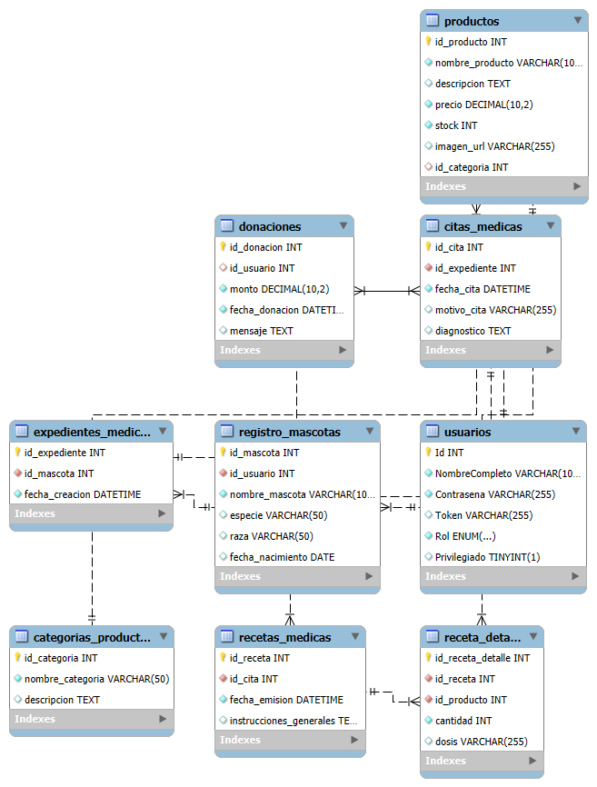

# 🐾 Veterinaria "Peludos Felices"

 


### Diagrama Entidad-Relación



Un AppWeb para la gestion de citas, mascotas y pacientes de la clinica veterinaria "Peludos Felices" Este proyecto integra un front-end interactivo con un backend en Django y una base de datos MySQL con el objetivo de mostrar logros obtenidos durante el curso de Python en Fusalmo.

---

##  Tabla de Contenidos
1. [Caracteristicas Principales](#-características-principales)
2. [Tecnologias Utilizadas](#-tecnologías-utilizadas)
3. [Instalacion y Puesta en Marcha](#-instalación-y-puesta-en-marcha)
4. [Modo de Uso](#-modo-de-uso)

---

##  Arquitectura del Proyecto
* **Inicio de Sesion:** Sistema de autenticacion de usuarios/roles
* **Gestion de Mascotas:** Registro y consulta del historial de las mascotas
* **Sistema de Citas:** Creacion y visualización de citas medicas
* **Historial Clinico:** Expedientes medicos digitales para cada paciente
* **Recetas Medicas:** Generacion de recetas vinculadas a productos de la farmacia

---

##  Tecnologias Utilizadas
* **Front-End:** HTML5, CSS3, JavaScript
* **Back-End:** Python con el framework Django
* **Base de Datos:** MySQL
* **Despliegue:** Servidor de desarrollo de Django


---

##  Requerimientos de Instalacion y Despliegue 

Sigue estos pasos para levantar el proyecto en un entorno local.

1.  **Clonar el repositorio (si esta en GitHub):**
    ```bash
    git clone [https://github.com/C3sarPerd0m0D3v/veterinariaPeludosFeliz](https://github.com/C3sarPerd0m0D3v/veterinariaPeludosFeliz)
    cd veterinariaPeludosFeliz
    ```

2.  **Instalar dependencias del backend:**
    (Tener Python y pip instalados)
    ```bash
    pip install Django mysqlclient django-cors-headers
    ```

3.  **Configurar la base de datos:**
    * Tener WampServer instalado
    * Tener MySQL instalado
    * Crea una base de datos llamada `sistema_usuarios`.
    * Importa el script `.sql` para crear las tablas.
    * Actualiza los datos de conexion en el archivo `settings.py`.

4.  **Aplicar las migraciones de Django:**
    ```bash
    python manage.py migrate
    ```

5.  **Iniciar el servidor de Django:**
    ```bash
    python manage.py runserver
    ```
    El backend estara corriendo en `http://127.0.0.1:8000`.

6.  **Front-End:**
    Abre el archivo `login.html` usando la extensión "Live Server" de vs code para que corra en un puerto como `5501`.

---

##  Modo de uso

Una vez que ambos servidores (Django y Live Server (live server es opcional)) esten corriendo:
1.  Navegar a la pagina de `login.html` en el navegador
2.  Utiliza un usuario y contraseña existentes en la base de datos para iniciar sesion
3.  Explorar la aplicacion