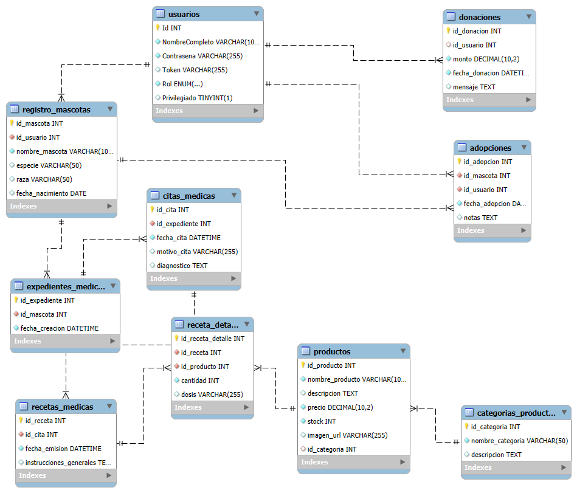

# 🐾 Veterinaria "Peludos Felices"

 


### Diagrama de Flujo de la Aplicacion


### Diagrama Entidad-Relación



Un AppWeb para la gestion de citas, mascotas y pacientes de la clinica veterinaria "Peludos Felices" Este proyecto integra un front-end interactivo con un backend en Django y una base de datos MySQL con el objetivo de mostrar logros obtenidos durante el curso de Python en Fusalmo.

---

##  Tabla de Contenidos
1. [Caracteristicas Principales](#-características-principales)
2. [Tecnologias Utilizadas](#-tecnologías-utilizadas)
3. [Instalacion y Puesta en Marcha](#-instalación-y-puesta-en-marcha)
4. [Modo de Uso](#-modo-de-uso)

---

##  Arquitectura del Proyecto
* **Inicio de Sesion:** Sistema de autenticacion de usuarios/roles
* **Gestion de Mascotas:** Registro y consulta del historial de las mascotas
* **Sistema de Citas:** Creacion y visualización de citas medicas
* **Historial Clinico:** Expedientes medicos digitales para cada paciente
* **Recetas Medicas:** Generacion de recetas vinculadas a productos de la farmacia

---

##  Tecnologias Utilizadas 🎨 Front-End 
  
  


### ⚙️ Back-End  
  


### 🗄️ Base de Datos  


### 🌐 Despliegue  


---

##  Requerimientos de Instalacion y Despliegue 

Sigue estos pasos para levantar el proyecto en un entorno local.

1.  **Clonar el repositorio (si esta en GitHub):**
    ```bash
    git clone [https://github.com/C3sarPerd0m0D3v/veterinariaPeludosFeliz](https://github.com/C3sarPerd0m0D3v/veterinariaPeludosFeliz)
    cd veterinariaPeludosFeliz
    ```

2.  **Instalar dependencias del backend:**
    (Tener Python y pip instalados)
    ```bash
    pip install Django mysqlclient django-cors-headers
    ```

3.  **Configurar la base de datos:**
    * Tener WampServer instalado
    * Tener MySQL instalado
    * Crea una base de datos llamada `sistema_usuarios`.
    * Importa el script `.sql` para crear las tablas.
    * Actualiza los datos de conexion en el archivo `settings.py`.

4.  **Aplicar las migraciones de Django:**
    ```bash
    python manage.py migrate
    ```

5.  **Iniciar el servidor de Django:**
    ```bash
    python manage.py runserver
    ```
    El backend estara corriendo en `http://127.0.0.1:8000`.
    (opcional) Inicializar AppWeb desde la carpeta de archivos del proyecto
    ```bash
    iniciar.bat
    ```
    requisito : tener previamente instalado dentro del proyecto en la terminal :
    ```bash
    npm install -g live-server
    ```

7.  **Front-End:**
    Abre el archivo `login.html` usando la extensión "Live Server" de vs code para que corra en un puerto como `5501`.


8. **Instalacion con Requirements.txt (recomendado se instala todo de una vez con un solo comando)**
    ```bash
    pip install -r requirements.txt
    ```

9. **Extensiones Recomendadas para VS Code para una mejor experiencia**

| Extensión | Editor | Propósito |
| :--- | :--- | :--- |
| **[Python](https://marketplace.visualstudio.com/items?itemName=ms-python.python)** | Microsoft | Proporciona autocompletado, depuración y soporte esencial para Python. |
| **[Django](https://marketplace.visualstudio.com/items?itemName=batisteo.vscode-django)** | Baptiste Darthenay | Ofrece atajos y resaltado de sintaxis específico para el framework Django. |
| **[Live Server](https://marketplace.visualstudio.com/items?itemName=ritwickdey.LiveServer)** | Ritwick Dey | Inicia un servidor local para el front-end con recarga automática al guardar cambios. |
| **[Prettier - Code Formatter](https://marketplace.visualstudio.com/items?itemName=esbenp.prettier-vscode)** | Prettier | Formatea automáticamente el código HTML, CSS y JavaScript para mantenerlo limpio y ordenado. |
| **[GitLens](https://marketplace.visualstudio.com/items?itemName=eamodio.gitlens)** | GitKraken | Mejora la integración con Git, permitiendo ver quién y cuándo modificó cada línea de código. |
| **[Material Icon Theme](https://marketplace.visualstudio.com/items?itemName=PKief.material-icon-theme)** | Philipp Kief | Asigna iconos específicos a cada tipo de archivo, mejorando la navegación visual del proyecto. |

---

##  Modo de uso

Una vez que ambos servidores (Django y Live Server (live server es opcional)) esten corriendo:
1.  Navegar a la pagina de `login.html` en el navegador
2.  Utiliza un usuario y contraseña existentes en la base de datos para iniciar sesion
3.  Explorar la aplicacion

## Credenciales para pruebas 
 
    Usuario		Contraseña
1. Juan Pérez	farmacia123	
2. María Gómez 	vet456
3. Carlos Ruiz	admin789
4. Ana          123
